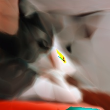
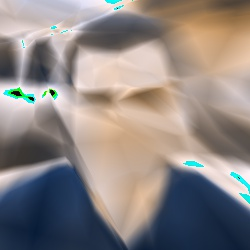
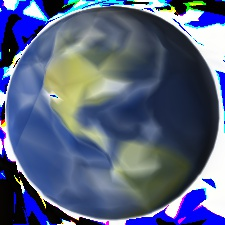

This is an implementation of [Neural Network "paints" and Image](http://cs.stanford.edu/people/karpathy/convnetjs/demo/image_regression.html) in TensorFlow.

The neural network is trained on a single image. It accepts the pixel position as input and trains a neural network to output the RGB value of the pixel. Since this NN tries to learn to paint a single image, overfitting is good!

####Usage:
To train with default options run:
```
python painter.py [image_filename]
```

For additional optional arguments check:
```
python painter.py --help
```

####Samples:




